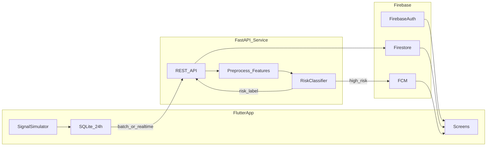

# Architecture

```mermaid
flowchart LR
  subgraph mobile [FlutterApp]
    UI[Screens]
    LocalDB[SQLite_24h]
    Sim[SignalSimulator]
  end
  subgraph cloud [Firebase]
    Auth[FirebaseAuth]
    FS[Firestore]
    FCM[FCM]
  end
  subgraph ai [FastAPI_Service]
    API[REST_API]
    Pre[Preprocess_Features]
    Model[RiskClassifier]
  end
  Sim --> LocalDB
  LocalDB -->|batch_or_realtime| API
  API --> Pre --> Model
  Model -->|risk_label| API
  API --> FS
  Model -->|high_risk| FCM
  Auth --> UI
  FS --> UI
  FCM --> UI
```

## Local demo cloud
When `DEMO_MODE=true`, Firestore is mirrored in-memory inside `SyncService` so the full path works without credentials.
